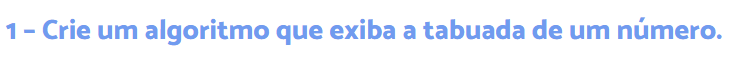
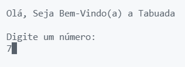
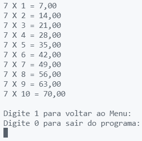

# Tabuada

## Objetivo

</img>

## Linguagem Utilizada

<ul>
<li>C#</li>
</ul>

## Programa em Execução

</img>

 </img>

### OBS:
<ul>
<li>Foi utilizado um try/catch para tratar erros</li>
<li>É permitido números decimais</li>
</ul>